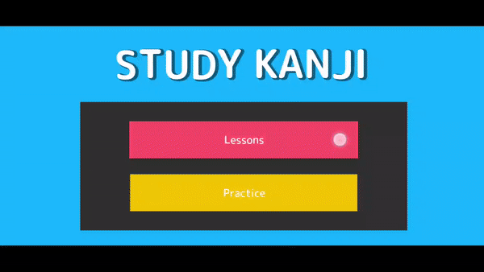

# Unity-Kanji-learning
In order to test the efficiency of the implementation of game elements and mnemonics into the study of Kanji the following 2D Android & Windows game was developed using Unity.

## System Design
The proposed system named Study Kanji contains the following basic
functions:
1) Lesson game mode: to help memorize Kanji utilizing the mnemonics method providing a more effective and entertaining retention of the information
2) Practice game mode: which utilizes game elements (timed quizzes, score system with colorful reward and punishment messages and levels) to maintain motivation
3) Study support tool: because it can used for short amounts of time, any time of the day it becomes part of a daily routine that develops healthy study habits.

## Lessons Mode
The Lesson game-mode consists of 6 different theme divided lessons where the user will learn the N5 level kanji, the amount of kanji per lesson ranges from 10 to 30, therefore some lessons make take more time to complete than others. Once the user clicks on the desired lesson, they will see the kanji lesson screen.



The various sections of the Kanji Lesson are as follows:

  a) Kanji: The Japanese Kanji the current lesson focuses in.

  b) Unique English keyword: the approximate meaning of the Kanji inE nglish, some Kanji may have various meanings.

  c) Onyomi: Onyomi is the way that the kanji is pronounced when it's used in compound (Jukugo) words.

  d) Kunyomi: Kunyomi indicates how the kanji is pronounced by itself. 

  e) Breakdown + Mnemonic: Different to most Kanji teaching material in Study Kanji the aim is to explain what every individual part of the kanji, all its radical and what they mean so that when they come together the user can have an idea of how the kanji is built.

  g) Lookalikes: One of the biggest challenges when learning kanji is how many kanji look very similar to one another. 

  h) Index number: a sequence number to indicate the user how many kanji they have memorized and how many kanji are left in the lesson.

## Practice Mode
This mode includes 7 levels, one for each lesson and a final one with questions from all the lessons. Each practice level has from 3 to 10 questions, where the user is presented a hiragana word and has to select the correct Kanji belonging to it before the time runs out, if the correct Kanji is submitted, they accumulate points, if they answer incorrectly they lose points. 


Once the user submits the answer, a screen will be displayed accordingly whether the answer was correct or wrong. Showing also how many points they gained or lost.
After a second, the feedback screen fades and the next question is displayed. Once the final question of the level is submitted the final screen will show.

In this screen the user is shown how much they scored, the current high score, a button to return to the index and a button to continue to the next level.
Once the final level is cleared the “Play next level” button will instead show the “Play from level 1” label to allow the user to try the lessons again and better their high score.

```
//Submit answer method
    public void Accept()
    {
      
        UpdateTimer(false);
        bool isCorrect = CheckAnswers();
        FinishedQuestions.Add(currentQuestion);

        //Addup score
        UpdateScore((isCorrect)? data.Questions[currentQuestion].AddScore : -data.Questions[currentQuestion].AddScore);

        //Load next level if all questions from current level have been answered
        //If its last level, ask if user wants to play again
        if (IsFinished)
        {
            events.level++;
            if(events.level>GameEvents.maxLevel)
            {
                events.level =1;
                nextText.text = "Play From level 1?";
            }
            SetHighscore();
        }

        //Set up UI depending if answe was correct/incorrect or if it was last answer
        var type
            = (IsFinished)
            ? UIManager.ResolutionScreenType.Finish
            : (isCorrect) ? UIManager.ResolutionScreenType.Correct
            : UIManager.ResolutionScreenType.Incorrect;

      
            events.DisplayResolutionScreen(type, data.Questions[currentQuestion].AddScore);
        
        //If it was the last answer go to next level
        if(type !=UIManager.ResolutionScreenType.Finish)
        {
            if (IE_WaitTillNextRound != null)
            {
                StopCoroutine(IE_WaitTillNextRound);
            }
            IE_WaitTillNextRound = WaitTillNextRound();
            StartCoroutine(IE_WaitTillNextRound);
        }
        

    }
 ```
 
m_EditorVersion: 2019.2.6f1

m_EditorVersionWithRevision: 2019.2.6f1 (fe82a0e88406)


